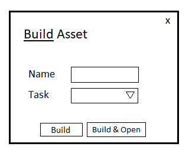

# Mini Pipeline

Création d'un petit pipeline Maya, possédant plusieurs fonctionnalités


- Créations d'un build Modeling avec un template (architecture de la scène préparée)
- Save réalisable en WIP ainsi qu'en Publish (avec création entière du chemin pour le projet si non existante)
- Ouverture d'un Publish pour le transformer en WIP pour un changement de Task (ex : ouverture du Publish Modeling pour faire le WIP Texturing)
- Création d'un Launcher permettant d'ouvrir le tool avant même l'ouverture du programme (permettant de créer une base d'un build Modeling dès l'ouverture du programme)


### Interface

Croquis de l'idée de base de l'interface (point de départ du visuel voulu)


## Variables d'Environment

Le projet contient un "__ init __.py" dans le dossier conf contenant des Variables d'Environment, si jamais le dossier n'est pas disponible veuillez les ajouter

`asset_path = asset_path = "D:/ABYGAELLE_FABRE/WS_MicroFilm/MOVIE/ASSETS/{name}/{task}/{state}/{name}_{task}_{version}.{extension}"`

`template_path = "D:/ABYGAELLE_FABRE/Pipeline_Git/pipeline/maya/templates/modeling_template.ma"`

`grp_valid = ["front", "persp", "side", "top", "top_grp"]`

`mayaQt_env = "start rez env maya " + os.environ["REZ_USED_REQUEST"] + " -- maya"`

***Veillez à bien vérifier les chemins du fichier et à les modifier si ils ne sont pas bon !***

## Lancement Local

• Cloner le repo

```bash
  git clone https://github.com/Ayaee/pipeline.git
```

• Vérifier le init.py et les variables d'environnements, ainsi que leur chemins

• Avoir une configuration rez de prête et ajouter le "*pipeline*" se situant dans le dossier "*rez"* du repo

• Aller dans le dossier "*exe*" et sortir le Launcher en .bat sur son bureau

• Cliquer sur "***Pipeline Launcher.bat***" et remplisser les champs


### Optimisations futurs

- Rendre le tool utilisable sur divers DCC
- Réaliser une version plus complexe de l'interface permettant à l'utilisateur plus de maîtrise sur son tool, [PipelineV.2](https://github.com/Ayaee/Pipeline_Browser)


### Infos +
Coucou Gaetan ! Je te fais une petite partie en plus car je n'ai pas l'impression que tout est bien expliqué, le mini pipe est pour le moment utile seulement sur Maya, il s'utilise soit avec le .bat à l'extérieur de Maya sur son bureau mais ne peut donc faire que le buil de base de modeling, soit dans Maya pour build et publish n'importe quel scène.
<br/>(Sur mon ordi j'ai dans Maya deux tool que j'ai fais en script pour avoir mon interface build et mon publish, mais je ne suis pas sûre que tu les auras de base, si jamais ce n'est pas le cas, dis le moi et je rajouterais les deux scripts Maya pour les tools)


## Retour

Si vous avez des retours à me transmettre pour améliorer certaines choses n'hésitez pas à me contacter sur afabre@artfx.fr par mail ou pas Google Chat


## Auteur

- [@abygaëllefabre](https://github.com/Ayaee)

